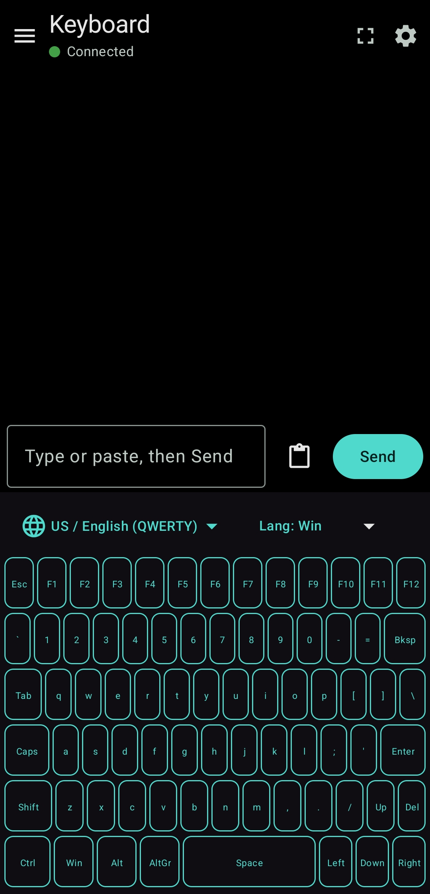
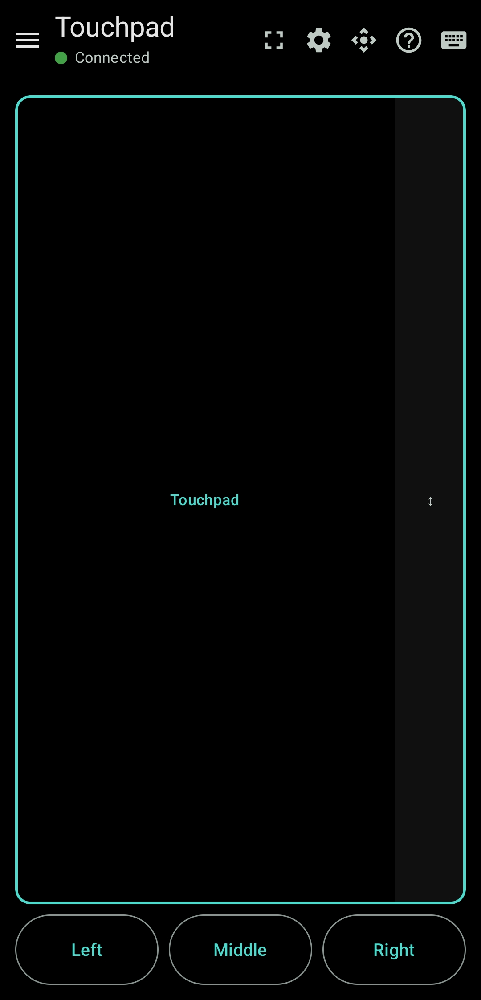
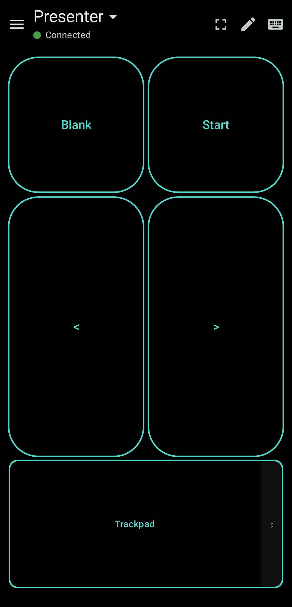
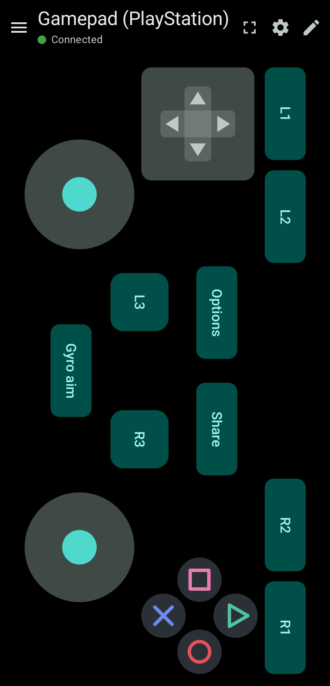
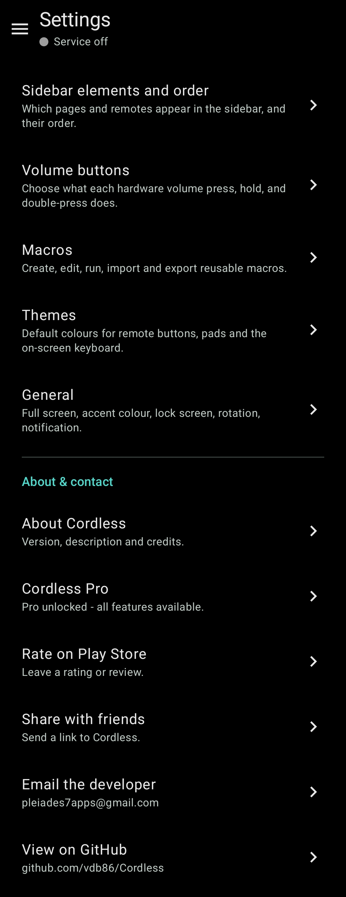

# Cordless

### A keyboard, mouse and controller, right in your pocket

**Turn your phone into a Bluetooth keyboard, mouse and controller.**

  

---

## 💬 Feedback, bug reports & feature requests

Found a bug or have an idea? This is the place to let me know.

- 🐞 **Found a bug?** [Report a bug](../../issues/new?template=bug_report.yml) and tell us what happened, what you expected, and your device / Android version.
- 💡 **Have an idea?** [Request a feature](../../issues/new?template=feature_request.yml) - I read every suggestion.
- 👍 **Want something that's already been suggested?** Browse [bug reports](../../issues?q=is%3Aissue+label%3Abug) and [feature requests](../../issues?q=is%3Aissue+label%3Aenhancement) and add a 👍 or a comment so I know it matters to you.

Please search the [open issues](../../issues) first to avoid duplicates.

---

## What it does

Cordless turns your Android phone into a wireless keyboard, touchpad/mouse, media remote, and game controller for another device - your PC, laptop, tablet, TV box, or HTPC. It uses Android's built-in Bluetooth HID support, so your phone pairs like any ordinary Bluetooth keyboard or mouse.

## Features

- **Keyboard** - a full on-screen keyboard with modifiers and a quick text-input bar.
- **Touchpad** - a smooth mouse pad with left/middle/right buttons, two-finger scroll, and a scroll strip.
- **Media & system keys** - play/pause, volume, and other consumer controls.
- **Remotes** - build your own button layouts for a media remote, a presentation clicker, or app shortcuts.
- **Gamepad** - on-screen sticks, D-pads and buttons for PC and Android games.
- **Custom layout editor** - place buttons freely; pick shapes, sizes, colours, borders and icons; assign any keyboard, media, mouse or gamepad action.
- **Themes** - restyle your controls with built-in presets or save your own.
- **Macros** - record a sequence of key presses once and reuse it on any button.
- **Backup & restore** - export your whole setup to a file and bring it back any time.
- **No ads, no tracking, no internet access.**

## How it connects

Cordless uses the native Android Bluetooth HID device role, so the other device sees a standard Bluetooth keyboard, mouse, and gamepad. To connect the first time, open your computer or TV's own **Add a Bluetooth device** screen and pick your phone. After that, Cordless reconnects automatically. Works with Windows and Android hosts.

The keyboard, touchpad, media keys, and remote layouts work out of the box on every host - nothing extra to install.

## ⚠️ Known issue: some Xiaomi phones can't pair

A few phones have a bug in the phone's **own Bluetooth software** that stops them pairing as a keyboard/mouse/controller. So far this is confirmed on **Xiaomi** devices - and it also affects **Redmi** and **POCO**, which run the same MIUI/HyperOS software.

**The tell-tale sign:** you start pairing from your computer, and then **the phone** shows **"Incorrect PIN or passkey."** The computer, meanwhile, looks like it paired fine - but the connection doesn't work.

What's really happening: the two devices actually complete pairing, and then the phone's Bluetooth software rejects it a split second later and shows that error. The computer never hears about it, so it still lists the phone as paired. Either way, nothing works.

**This is not something Cordless - or any similar app - can fix.** It's in the phone's Bluetooth firmware, below what any app is allowed to touch. The exact same app pairs normally on other brands (for example, Samsung). If you see this error on a phone that **isn't** a Xiaomi, Redmi, or POCO, please [report it](../../issues/new?template=bug_report.yml) right away - we'd like to know which other devices are affected.

## Using the gamepad on a computer

The gamepad connects as a **standard Bluetooth HID controller**. How well games recognise that depends on the platform:

- **Android** - works out of the box. Games see the controller natively, nothing extra needed.
- **Windows** - the controller is detected as a **DirectInput** device. It will work in Windows' own "Game controller settings" test and in games that support DirectInput, but **most modern games only accept XInput** (the Xbox controller standard) and won't see a DirectInput device.
- **macOS** - macOS games use Apple's Game Controller framework, which recognises a **fixed list of known controllers** (Xbox, PlayStation, MFi). A generic controller is often not detected.

To use the gamepad with XInput-only games on Windows or macOS, run it through a layer that presents a **virtual Xbox (XInput) controller** fed by the HID gamepad:

- **[Steam Input](https://partner.steamgames.com/doc/features/steam_controller/steam_input_gamepad_emulation_bestpractices)** (recommended, built into Steam) - in Steam, enable *Settings → Controller → Generic Gamepad Configuration Support*, then launch the game from Steam. Steam wraps the controller as a virtual Xbox pad.
- **[x360ce](https://www.x360ce.com/)**, **reWASD**, or **DS4Windows** - standalone tools that create a virtual XInput device from the HID gamepad.

This is a limitation of how Windows and macOS handle non-Xbox controllers, not of Cordless - it applies to generic Bluetooth controllers in general.

## Screenshots

<table>
  <tr>
    <td align="center"> <b>Keyboard</b> Full on-screen keyboard + text bar</td>
    <td align="center"> <b>Touchpad</b> Mouse pad with click buttons & scroll</td>
    <td align="center"> <b>Media remote</b> D-pad, OK & playback controls</td>
    <td align="center"> <b>Presenter</b> Slide controls & trackpad</td>
  </tr>
  <tr>
    <td align="center"> <b>Gamepad</b> Dual sticks, buttons, triggers, gyro aim</td>
    <td align="center"> <b>Settings</b> Sidebar, macros, themes & more</td>
    <td align="center"> <b>Layout editor</b> Shapes, colours, borders & behaviour</td>
    <td align="center"> <b>Action picker</b> Modifiers, function & full keyboard keys</td>
  </tr>
  <tr>
    <td align="center"> <b>Media keys</b> Play/pause, volume & browser keys</td>
    <td align="center"> <b>OS shortcuts</b> Ready-made keys per operating system</td>
    <td></td>
    <td></td>
  </tr>
</table>

## Free & Pro

The free version gives you a fully working **keyboard and touchpad** - everything you need to control another device.

**Cordless Pro** is a single one-time purchase (no subscriptions) that unlocks remote layouts, gamepad controls, the custom layout editor, themes, macros, backup & restore, and extra settings.

## Requirements

- Android 10 (API 29) or newer
- A host that accepts a standard Bluetooth keyboard/mouse/gamepad (Windows or Android)

> Game consoles (Xbox, PlayStation, Switch) are **not** supported - they reject standard Bluetooth controllers. Cordless targets PC and Android.

## Privacy

Cordless processes everything locally on your device. It does not request the internet permission, so nothing you type or tap can leave your phone. No analytics. No tracking. No account.
